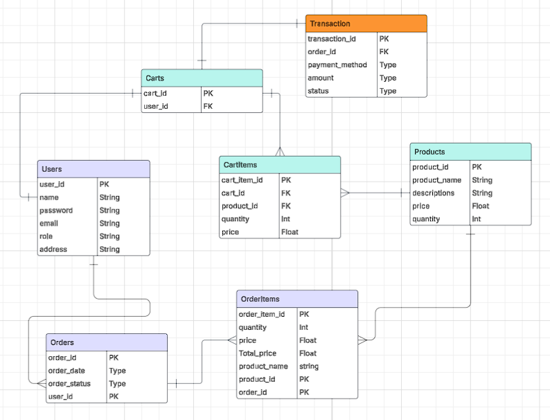

# Product Management System

## Overview
A comprehensive product management system built with Node.js and Express.js, featuring RESTful APIs for user authentication, shopping cart management, and order processing. Uses PostgreSQL for data storage and includes JWT authorization and OTP verification.

## Core Features
- User Authentication (Register/Login/OTP)
- Product Management (CRUD operations)
- Shopping Cart Management
- Order Processing
- Email Notifications
- Admin Controls

## Tech Stack
- **Backend**: Node.js, Express.js
- **Database**: PostgreSQL with Prisma ORM
- **Security**: JWT, bcryptjs, crypto-js
- **Email**: Nodemailer
- **Development**: Nodemon
- **Utilities**: dotenv, cors, morgan

## ER Diagram

## API Endpoints

### Authentication
- POST `/register` - User registration
- POST `/login` - User login
- POST `/logout` - User logout
- POST `/otp/request` - Request OTP
- PUT `/updatePassword` - Change password

### Users
- GET `/users` - List users (Admin)
- PUT `/user/:id` - Update user
- DELETE `/user/:id` - Remove user (Admin)

### Products
- GET `/products/:count` - List products
- POST `/product` - Create product
- PUT `/product/:id` - Update product
- DELETE `/product/:id` - Delete product

### Orders & Cart
- GET `/orders` - List orders
- POST `/orders/:user_id` - Create order
- GET `/carts/:user_id` - View cart
- POST `/carts/:user_id/items` - Add to cart
- DELETE `/carts/:user_id` - Clear cart

For complete API documentation, see `docs/api.md`.
